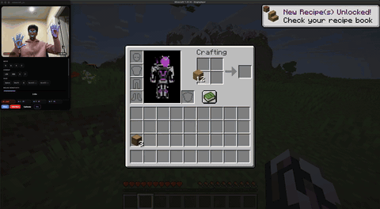

# minecraft_cv — Play Minecraft with your hands


> **Vanilla Minecraft. No mods, no plugins. Just your webcam.**
> Your hands walk, mine, build, jump, and aim — in real time, at full speed.

## Demo

<p align="center"></p>

<p align="center"></p>

<p align="center"></p>

---

## Quickstart

macOS 13+ and Python 3.11+. One command:

```bash
git clone https://github.com/AnishYarrakonda/Minecraft-CV && cd Minecraft-CV
./setup.sh
```

Then launch the app:

```bash
source .venv/bin/activate
mcv ui
```

The app opens in **Dry-Run** mode — nothing touches your real mouse or keyboard until you click **Go Live**. Open Minecraft, click Go Live, and play.

> macOS will ask for **Camera** and **Accessibility** permissions on first run.
> Grant both (to your terminal app), or run `mcv doctor` to check what's missing.

---

## Controls

Open or relaxed hands = idle. Pinch your **thumb to a fingertip** to act.
Both hands, your face, and your head all work **at the same time** — walk, aim, mine, and open your inventory simultaneously.

### Left hand — movement (WASD)

| Gesture | Action |
|---|---|
| Thumb → **index** | Move right (D) |
| Thumb → **middle** | Move forward (W) |
| Thumb → **ring** | Move left (A) |
| Thumb → **pinky** | Move back (S) |

Hold two pinches at once for diagonals (index + middle = forward-right).

### Right hand — camera & combat

| Gesture | Action |
|---|---|
| **Move hand across the frame** | Aim camera |
| Thumb → **index** | Attack / mine (left click) |
| Thumb → **middle** | Place / interact (right click) |
| Thumb → **ring** | Jump (Space) |
| Thumb → **pinky** | Swap offhand (F) |
| ✌️ **Peace sign** | Recenter camera — see [Common Issues](#common-issues) |

Peace sign = index + middle fingers extended, ring + pinky curled.

### Face & head

| Gesture | Action |
|---|---|
| Raise eyebrows | Open inventory (E) |
| Open mouth | Throw item (Q) |
| Nod head down | Sneak (hold Shift) |
| Tilt head toward left shoulder | Hotbar next |
| Tilt head toward right shoulder | Hotbar prev |

Run `mcv gestures` for the full reference card in your terminal.

---

## Common Issues

**1. The camera keeps drifting and I run out of room to aim.**
Your hand has a limited physical range, so the aim can drift off-center over time.
Hold the ✌️ **peace sign** to "lift the mouse": it freezes the camera, lets you reposition your hand anywhere comfortable, and resumes aiming from the new spot — no snap. Use it freely whenever you need to recenter.

**2. Black or frozen camera feed.**
This is almost always a permissions issue. macOS silently gives you black frames if Camera access isn't granted. Open **System Settings → Privacy & Security → Camera**, enable your terminal app (Terminal/iTerm/VS Code), and fully restart it. Run `mcv doctor` to confirm.

**3. Gestures show in the app but Minecraft doesn't respond.**
Input injection needs a separate **Accessibility / Input Monitoring** grant. Without it, key and mouse events are silently dropped. Enable your terminal app under **System Settings → Privacy & Security → Accessibility**, then restart it. Also make sure you clicked **Go Live**, not just opened the app.

**4. It grabbed my iPhone instead of my webcam.**
macOS Continuity Camera may silently pick your iPhone as camera 0. Set the correct camera index in `config.yaml` and relaunch. Run `mcv doctor` to see what it's seeing.

**5. The camera look feels laggy or twitchy.**
Sensitivity and smoothing both live in `config.yaml` under `joystick:`. Lower `right_sensitivity` if aiming feels twitchy; adjust `one_euro_min_cutoff` and `one_euro_beta` if flicks feel sluggish. If the whole app feels slow, close other camera apps and confirm you're on Apple Silicon (the CPU path targets 30 fps).

---

## Commands

| Command | Description |
|---|---|
| `mcv ui` | Desktop app (recommended). Camera on top, key grid below. **Pin** keeps it floating over fullscreen Minecraft; shrink it short to collapse into a camera-only HUD. |
| `mcv run` | Headless controller (`--input` for live input, `--no-input` for dry run) |
| `mcv doctor` | Check camera, permissions, and system health |
| `mcv analyze <clip>` | Run a recorded clip through the pipeline offline |
| `mcv bench` | Benchmark tracking latency |
| `mcv gestures` | Print the full gesture reference card |

---

<br>

> The rest of this README is for the curious — how it's built and why it's safe.
> You don't need any of it to play.

## How it works

Three independent streams run on every camera frame without blocking each other:

**Left hand** reads which fingers are pinched and maps them to WASD keys. Pinch distances are normalized by hand size, so the thresholds work whether you're close to or far from the camera. Each pinch has a small engage/release gap built in so keys don't chatter at the threshold.

**Right hand** does two things at once: the same pinch detection drives combat buttons (attack, place, jump, swap), while the position of your index knuckle drives camera look as a relative mouse delta. A smoothing filter cuts jitter when your hand is still without adding lag when you move fast. The peace-sign "clutch" reseeds the look anchor without snapping the camera — the same way lifting a mouse works.

**Face + head** run alongside hand tracking. Raised eyebrows and an open mouth map to inventory and throw. Head tilt drives hotbar scroll. A nod down triggers sneak. These are entirely independent — you can walk, aim, and open your inventory at the same time.

Everything runs on CPU at 30 fps on Apple Silicon — no GPU required.

## Safety

- The input emitter does nothing by default — dry-run and tests never touch your real mouse or keyboard.
- If your hand leaves the frame mid-gesture, every held key releases immediately. No stuck jumps, no infinite sneaking.
- CPU always works; the optional GPU accelerator is never a hard dependency.

## License

MIT — see [LICENSE](LICENSE).
