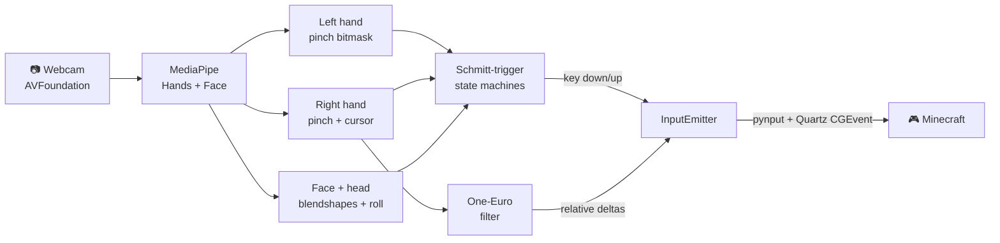

# minecraft_cv — Play Minecraft with your hands 🤚


> **Vanilla Minecraft. No mods, no plugins. Just your webcam.**
> Your hands walk, mine, build, jump, and aim — in real time, at full speed.

<!--
  🎥 HERO VIDEO — drag your .mp4 onto the line below directly in the GitHub
  README editor. GitHub uploads it and replaces this comment with a playable
  video player. (A raw <video src="..."> to a repo file will NOT autoplay on
  GitHub — the drag-and-drop user-attachments URL is what renders.)
-->

https://github.com/AnishYarrakonda/Minecraft-CV/assets/REPLACE-ME/demo.mp4

---

## ⚡ Quickstart

macOS 13+ and Python 3.11+. One command:

```bash
git clone https://github.com/AnishYarrakonda/Minecraft-CV && cd Minecraft-CV
./setup.sh
```

Then launch the app:

```bash
source .venv/bin/activate
mcv ui
```

That's it. The app opens in **Dry-Run** mode — nothing touches your real mouse or
keyboard until you click **Go Live**. Open Minecraft, click Go Live, and play.

> macOS will ask for **Camera** and **Accessibility** permissions on first run.
> Grant both (to your terminal app), or run `mcv doctor` to check what's missing.

---

## 🎮 Controls

Open or relaxed hands = idle. Pinch your **thumb to a fingertip** to act.
Both hands, your face, and your head all work **at the same time** — walk, aim,
mine, and open your inventory simultaneously.

### 🫲 Left hand — movement (WASD)

| Gesture | Action |
|---|---|
| Thumb → **index** | Move right (D) |
| Thumb → **middle** | Move forward (W) |
| Thumb → **ring** | Move left (A) |
| Thumb → **pinky** | Move back (S) |

Hold two pinches for diagonals (index + middle = forward-right).

### 🫱 Right hand — camera & combat

| Gesture | Action |
|---|---|
| **Move hand across the frame** | Aim camera (mouse look) |
| Thumb → **index** | Attack / mine (left click) |
| Thumb → **middle** | Place / interact (right click) |
| Thumb → **ring** | Jump (Space) |
| Thumb → **pinky** | Swap offhand (F) |
| ✌️ **Peace sign** (index + middle up, ring + pinky curled) | Recenter camera — see [Common Issues](#-common-issues) |

### 😮 Face & head

| Gesture | Action |
|---|---|
| Raise eyebrows | Open inventory (E) |
| Open mouth | Throw item (Q) |
| Nod head down | Sneak (hold Shift) |
| Tilt head toward left shoulder | Hotbar next (scroll up) |
| Tilt head toward right shoulder | Hotbar prev (scroll down) |

Want the full reference card in your terminal? Run `mcv gestures`.

---

## 🛠 Common Issues

**1. The camera keeps drifting and I run out of room to aim.**
Your hand has a limited physical range, so the camera anchor can drift off-center.
Hold the ✌️ **peace sign** to "lift the mouse": it freezes the camera, lets you
reposition your hand anywhere comfortable, and resumes aiming from the new spot —
no snap. This is the intended way to recenter; use it freely.

**2. Black or frozen camera feed (no hand detected).**
This is almost always a permissions issue, not a bug. macOS silently hands you
black frames if Camera access isn't granted. Open **System Settings → Privacy &
Security → Camera**, enable your terminal app (Terminal/iTerm/VS Code), and fully
restart it. Run `mcv doctor` to confirm.

**3. Gestures show in the app but Minecraft doesn't respond.**
Input injection needs **Accessibility / Input Monitoring** — a *separate* grant
from Camera. Without it, key/mouse events are dropped with no error. Enable your
terminal app under **System Settings → Privacy & Security → Accessibility**, then
restart it. (Also: make sure you clicked **Go Live**, not just opened the app.)

**4. It grabbed my iPhone instead of my webcam.**
macOS Continuity Camera may silently pick your iPhone as camera 0. Pin the right
device by setting the camera index in `config.yaml`, then relaunch. Run
`mcv doctor` to list what it's seeing.

**5. The camera look feels laggy or jittery.**
Look smoothing and sensitivity live in `config.yaml` under `joystick:`. Lower
`right_sensitivity` if aiming feels twitchy; tune `one_euro_min_cutoff` /
`one_euro_beta` if it feels mushy when flicking. If the whole app is slow, close
other camera apps and confirm you're on Apple Silicon (CPU path targets 30 fps).

---

## 📋 Commands

| Command | Description |
|---|---|
| `mcv ui` | Polished desktop app (recommended). Camera on top, compact key grid below. **Pin** keeps it in front of Minecraft (even fullscreen); shrink it short to collapse into a camera-only HUD |
| `mcv run` | Headless controller (`--input` live, `--no-input` dry-run) |
| `mcv doctor` | Check camera, permissions, and system health |
| `mcv analyze <clip>` | Run a recorded clip through the pipeline offline |
| `mcv bench` | Benchmark tracking-backend latency |
| `mcv gestures` | Print the full gesture reference card |

---

<br>

> The rest of this README is for the curious — how it's built and why it's safe.
> You don't need any of it to play.

## 🧠 How it works

Three independent signal streams run concurrently on every camera frame, each
decoupled so they never block or conflict with one another:



**Pinch bitmask (both hands).** Thumb-to-fingertip distances are computed in one
vectorized NumPy call and normalized by hand scale, so thresholds stay valid no
matter how close you are to the camera. Each pinch passes through a **Schmitt-trigger
hysteresis gate** (`T_engage < T_release`) that swallows threshold jitter — no key
chatter. Left-hand pinches drive WASD; right-hand pinches drive attack, use, jump,
and swap-offhand.

**Cursor look (right hand).** The index-MCP landmark is tracked frame-to-frame, and
its deltas pass through a **One-Euro velocity-adaptive filter** (stable at rest,
snappy in motion) before being emitted as relative mouse moves via Quartz CGEvent.
The peace-sign clutch reseeds the cursor anchor without moving the camera.

**Face + head.** MediaPipe FaceLandmarker runs alongside hand tracking. Blendshape
scores feed per-gesture Schmitt triggers (eyebrows → inventory, open mouth → throw);
the eye-corner angle drives a head-roll detector for hotbar scroll; and a head-pitch
ratio drives a nod-down detector for sneak.

Everything runs on **CPU at 30 fps on Apple Silicon** — no GPU required. MPS is an
optional accelerator, never a dependency.

## 🔒 Safety

1. The input emitter is a **no-op by default** — dry-run and tests never move your
   real mouse or press real keys.
2. **Tracking loss releases every held key immediately** — no stuck jumps, no
   infinite sneaking if your hand leaves the frame.
3. **CPU fallback always works**; MPS acceleration is purely optional.
4. `T_release > T_engage` strictly for every pinch — asserted in the test suite.

## License

MIT — see [LICENSE](LICENSE).
